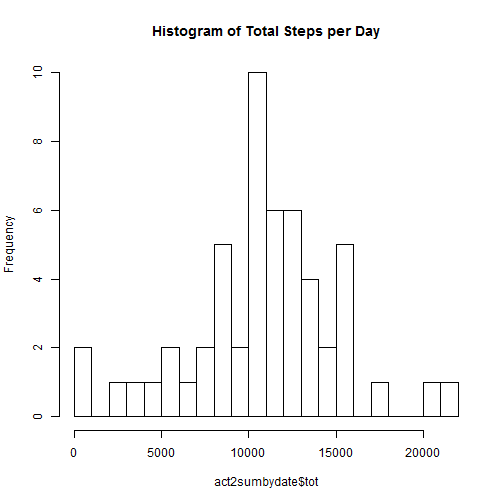

## Introduction

This is a demonstration of RMarkdown and Knitr.  In it we examine the Activity Monitoring data supplied in the first peer assessment of the Reproducible Research course. That file, "activity.csv", has been downloaded and saved in my working directory.  First, we read it into the object "act" and look at its structure, noting that "interval" is expressed in military time (1000 is 10:00 am).

```r
act <- read.csv("activity.csv")
str(act)
```

```
## 'data.frame':	17568 obs. of  3 variables:
##  $ steps   : int  NA NA NA NA NA NA NA NA NA NA ...
##  $ date    : Factor w/ 61 levels "2012-10-01","2012-10-02",..: 1 1 1 1 1 1 1 1 1 1 ...
##  $ interval: int  0 5 10 15 20 25 30 35 40 45 ...
```

## Analysis

Using dplyr we filter out the records where step=NA, store the result in "act2", sum the number of steps by date and store it in the object "act2sumbydate".  Looking at the structure of "act2sumbydate" we see that there are 53 out of 61 days with totals.  Then we plot a histogram of steps per day.


```r
library(dplyr)
```

```r
act2 <- filter(act, !is.na(steps))
act2sumbydate <- act2 %>% group_by(date) %>% summarise(tot = sum(steps))
str(act2sumbydate)
```

```
## Classes 'tbl_df', 'tbl' and 'data.frame':	53 obs. of  2 variables:
##  $ date: Factor w/ 61 levels "2012-10-01","2012-10-02",..: 2 3 4 5 6 7 9 10 11 12 ...
##  $ tot : int  126 11352 12116 13294 15420 11015 12811 9900 10304 17382 ...
##  - attr(*, "drop")= logi TRUE
```

```r
hist(act2sumbydate$tot, breaks = 20, main = "Histogram of Total Steps per Day")
```

 

Next we calculate the mean and median of total steps per day.


```r
mean(act2sumbydate$tot)
```

```
## [1] 10766.19
```

```r
median(act2sumbydate$tot)
```

```
## [1] 10765
```
To plot the average number of steps in each of the daily 5 minute time intervals, we again use dplyr to group the steps by interval and store the average of each in the object "act2avgbyint".  We notice that the largest value is around 200 and occurs in an interval some time before 1000.  In order to identify the particular interval we arrange the records in descending order and inspect the first (largest value) row to see that interval is 835 with a value of 206.1698.


```r
act2avgbyint <- act2 %>% group_by(interval) %>% summarise(avg = mean(steps))
plot(act2avgbyint, type = "l", main = "Average Number of Steps per 5-Minute Interval")
```

 

```r
sortavgbyint <- arrange(act2avgbyint, desc(avg))
sortavgbyint[1,]
```

```
## Source: local data frame [1 x 2]
## 
##   interval      avg
## 1      835 206.1698
```

By looking at the summary of "act" we see that the variable "steps" **contains NA in 2304 rows**.


```r
summary(act)
```

```
##      steps                date          interval     
##  Min.   :  0.00   2012-10-01:  288   Min.   :   0.0  
##  1st Qu.:  0.00   2012-10-02:  288   1st Qu.: 588.8  
##  Median :  0.00   2012-10-03:  288   Median :1177.5  
##  Mean   : 37.38   2012-10-04:  288   Mean   :1177.5  
##  3rd Qu.: 12.00   2012-10-05:  288   3rd Qu.:1766.2  
##  Max.   :806.00   2012-10-06:  288   Max.   :2355.0  
##  NA's   :2304     (Other)   :15840
```
One approach to imputing values where steps = NA would be to randomly select a value from "act2avgbyint" and check the summary again.  First we make another copy of "act" in "act1", setting the seed to 123 for reproducibility.  There are no NA.


```r
act1 <- act
set.seed(123)
for(i in 1:length(act1$date)){
       if(is.na(act1$steps[i])){
              pick1 <- sample_n(act2avgbyint, 1, replace = TRUE)
              act1$steps[i] <- pick1$avg
       }
}
summary(act1)
```

```
##      steps                date          interval     
##  Min.   :  0.00   2012-10-01:  288   Min.   :   0.0  
##  1st Qu.:  0.00   2012-10-02:  288   1st Qu.: 588.8  
##  Median :  0.00   2012-10-03:  288   Median :1177.5  
##  Mean   : 37.29   2012-10-04:  288   Mean   :1177.5  
##  3rd Qu.: 26.99   2012-10-05:  288   3rd Qu.:1766.2  
##  Max.   :806.00   2012-10-06:  288   Max.   :2355.0  
##                   (Other)   :15840
```
Again we calculate the number of steps by date, determine the mean and median, and plot a histogram. **The mean has changed from 10766.19 to 10738.52, and the median from 10765 to 10600.**


```r
act1sumbydate <- act1 %>% group_by(date) %>% summarise(tot = sum(steps))
mean(act1sumbydate$tot)
```

```
## [1] 10738.52
```

```r
median(act1sumbydate$tot)
```

```
## [1] 10600
```

```r
hist(act1sumbydate$tot, breaks = 20, main = "Total Steps per Day Histogram (with imputed values)")
```

 

To plot the average number of steps by interval separately for weekdays and weekends, we first convert the factor variable "date"" using POSIXct and use the weekdays() function to add a variable, "day",  then loop through all records to add another variable, "daytype", where "daytype" = "Weekend" if the day is Saturday or Sunday, and "Weekday" otherwise.  Finally, we average the number of steps by interval and create a two-panel plot.


```r
act1$date <- as.POSIXct(act1$date)
act1$day <- weekdays(act1$date)
for(i in 1:length(act1$date)){
       if(act1$day[i]=="Saturday" | act1$day[i]=="Sunday"){
              act1$daytype[i] <- "Weekend"
              }else{
                     act1$daytype[i] <- "Weekday"
              
              }
              
       
}

act1avgbyint <- act1 %>% group_by(daytype, interval) %>% summarise(avg = mean(steps))
library(lattice)
xyplot(avg ~ interval | daytype, data = act1avgbyint, layout = c(1,2), type = "l")
```

 
